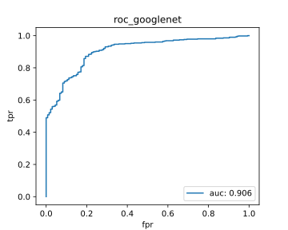
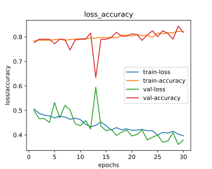

# CNNAlgosComparison

## Models For Comparison (All the models are written from scratch using pytorch)

1. Efficientnet
2. Googlenet
3. ResNet
4. Mobilenet
5. Shufflenet
6. Squeezenet

## Dataset

- Retianl Disease Classification (https://www.kaggle.com/andrewmvd/retinal-disease-classification)

### Team Members

- Mayank Raj (B19CSE053)
- Gautam Kumar (B19EE031)
- Nirbay Sharma (B19CSE114)

Results:

- **googlenet**

